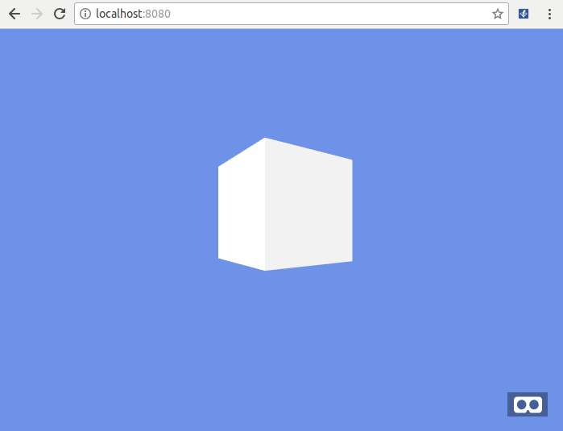

 

# JS13K A-Frame Boilerplate

This project is a boilerplate to start developing a WebXR game based on [A-Frame](https://aframe.io/) and [Webpack](https://webpack.js.org/) for the [js13k competition](https://2019.js13kgames.com/).


## Getting Started

### Prerequisites

- You need [node](https://nodejs.org/en/download/current/) installed.

### Installing

- Clone this repository
- Update `package.json` with your info
- Delete `.git` directory
- Delete unneeded files and blocks
- Download node dependencies

```bash
npm install
```

### Start development server

After installation you just need to run:

```bash
npm start
```

This will setup a server listening at `http://localhost:8080/`.

If everything went OK, you will see:



#### Access from another device

You can pass an argument to the development server specifying the interface to listen on.

```bash
npm start -- --host=0.0.0.0
```

This command will start the development server listening on all interfaces. Having a device on the same network you will be able to view the webpage at `http://[yourLocalIP]:8080` for example `http://192.168.1.1:8080`.

## Build for submission

This project provides a npm script for building your application

```bash
npm run build
```

This will generate two files index.html and build.zip both located in the dist/ folder. The zip file contains only the generated index.html. The output from the command also tells you how large is the generated zip file.

## Where does my code go?

All your javascript files should be located in the `src/app/` directory. The entry point is the `main.js` file. All your css should be located in the `src/styles` directory. The entry point is `main.css`. If you need to modify the html file, you can find the template used in `src/index.html`.

This project uses webpack for module bundling. This means that all the files that you want to use should be imported directly or indirectly by either `main.js` or `main.css`.

## ES2015+ support

This repository used to include [Babel](https://babeljs.io/) to enable working with modern JavaScript. As time progresses however the browser support for modern JS became excelent and webpack began shipping a newer version of uglify that can minify it. All of this makes it a rational choice to omit Babel as it would only increase the overall bundle size.

## License

This project is licensed under the MIT License - see the [LICENSE](LICENSE) file for details

## References

* This project is based on [https://github.com/sz-piotr/js13k-webpack-starter](https://github.com/sz-piotr/js13k-webpack-starter) by Piotr Szlachciak.
